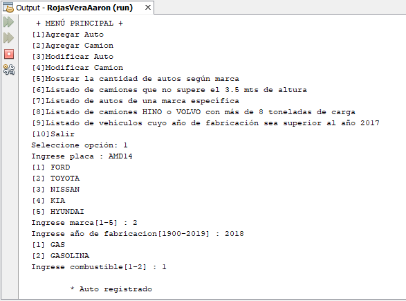

# Sistema de control de vehículos 2
Sistema sobre el control de Autos y Camiones con herencia múltiple donde se puede registrar un auto, registrar un camión, modificar un auto, modificar un camión, mostrar la cantidad de autos según marca, listado de camiones que no supere el 3.5 mts de altura, listado de autos de una marca específica, listado de camiones HINO o VOLVO con más de 8 toneladas de carga y listado de vehículos cuyo año de fabricación sea superior al año 2017, **27/12/19**.

<strong>Imagen:</strong> Menú principal - Agregar Auto.

